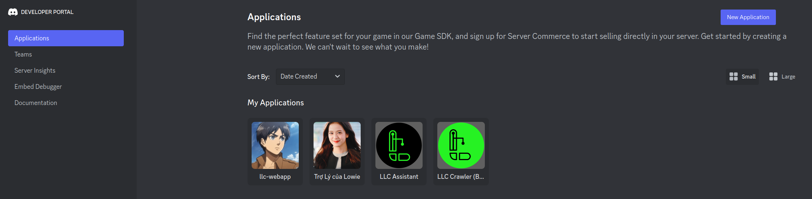
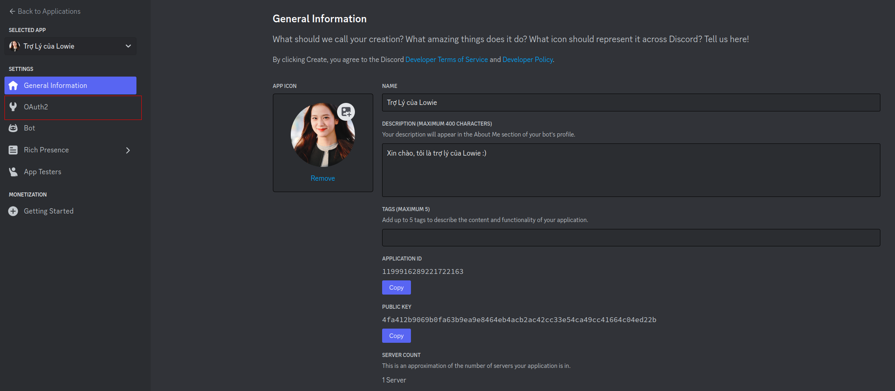
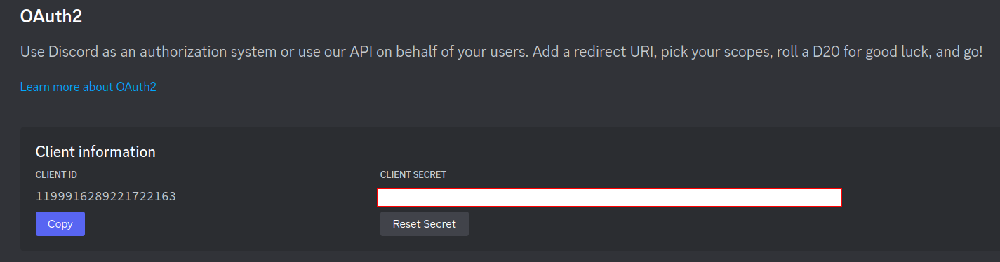
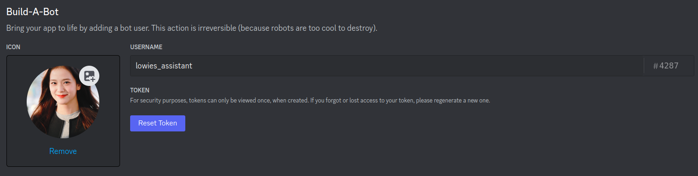
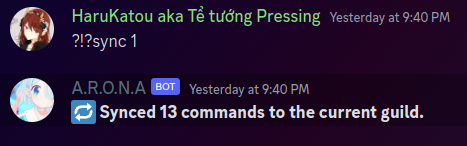

# LCHelper

Repo for LLC Assistant bot - A Discord bot built for Lowie's LeetCode Community (LLC) and all other stuff.

The database currently in use is `PostgreSQL`, and the library wrapper for the bot is `discord.py 2.0+`.

Current release Python version: `3.10.12`.

## Features

Command interface: [Notion page](https://funny-basket-693.notion.site/LLC-Assistant-Documentation-f28d36ddeb0046a0bab7b7c9745174d7).

Automation: [Notion page](https://lowie-writes.notion.site/Known-LCHelper-Automations-1-e7ed44f69e044e74918d7dedddf3c2ba?pvs=74).

## First-time Installation

### 1. Clone the repository

Clone the repo using GUI or command line:

-   If you have ssh set up: `git clone git@github.com:Lowie-s-Leetcode-Community/LCHelper.git`
-   If you don't: `git clone https://github.com/Lowie-s-Leetcode-Community/LCHelper.git`

### 2. Library

Make sure you have Python when running this:
Run: `pip install -r requirements.txt`

`psycopg2` installation is required, but has proven to be problematic on some machine. Please try running either:

```sh
pip install psycopg2
```

or

```sh
sudo apt-get install build-dep python3-psycopg2
```

### 3. Create an app in discord.com/developer

Go to [discord.com/developers](https://discord.com/developers/docs/intro) to create the bot:



-   Create a new application



-   In the OAuth2 part, save the `Client secret` somewhere for the section below.
-   In the Bot part, save the `Token` to use in the section below.

Note that both of these will only show up 1 time, if you want to get it again, it will generate a new one.



### 4. Set up .env file

Copy `.env.template` file to `.env` file and edit:



-   `BOT_TOKEN`: the **Token** you get from discord.com/developer in the above section.
-   `CLIENT_SECRET`: the **Client secret** of the bot from discord.com/developer in the above section.
-   `POSTGRESQL_CRED`: change 12345678 to your postgres password, lc_db to the schema's name.
-   `POSTGRESQL_SCHEMA`: schema's name.
-   `BOT_PREFIX`: depends on you.

Leave the rest as it is.

### 5. Database

#### PostgresSQL

We'll set up the database using llc-webapp repo, using Prisma tool.

Clone the web app to somewhere else: [llc-webapp](https://github.com/Lowie-s-Leetcode-Community/llc-webapp)
Follow part 1, 2, 3 in README.md in llc-webapp to set up postgreSQL

#### Redis

On linux distros:

```sh
apt-get update
apt-get install redis-server
systemctl start redis-server
systemctl status redis-server
```

On windows, follow [this guide](https://redis.io/docs/latest/operate/oss_and_stack/install/install-redis/install-redis-on-windows/).

### 6. Add your app as a bot into our server

Paste this URL into your browser:

```txt
https://discord.com/api/oauth2/authorize?client_id=<your-client-id>&permission=8&scope=bot%20applications.commands
```

Replace `<your-client-id>` with your bot's client ID.

### 7. Run the bot

-   To simply start LCHelper, just run:

```sh
python bot.py
```

### 8. Sync commands (Use when installing, or a new command is implemented)

Type into the #bot-commands channel:

```sh
<bot-prefix>sync 1
```

Replace `<bot-prefix>` with your prefix of choice.

**Example**: if you've set `BOT_PREFIX` as `?!?`, you should type `?!?sync 1` into the #bot_commands server.



## Notes

-   Please come up with your own `BOT_PREFIX` in case of many devs working at the same time.
-   Please use `/set_logging` to the dedicated channel for bot-dev logging. The default channel is public.

## Documentations

-   To learn more about discord.py: [discordpy.readthedocs](https://discordpy.readthedocs.io/en/latest/index.html#manuals)
-   To learn more about sql in python: [sqlalchemy](https://www.sqlalchemy.org/)
-   The command does use both normal commands (prefix) and slash commands. Make sure you are familiar with command tree, slash commands and interaction:
    -   [Bot commands tree and syncing guide](https://gist.github.com/AbstractUmbra/a9c188797ae194e592efe05fa129c57f)
    -   [Bot interaction guide](https://gist.github.com/AbstractUmbra/a9c188797ae194e592efe05fa129c57f)
-   Just-in-case guidelines: [python guide](https://www.w3schools.com/python/)

## License

[MIT](https://choosealicense.com/licenses/mit/)

Made with 🧡 by Lowie's Leetcode Community Bot Development Team.
